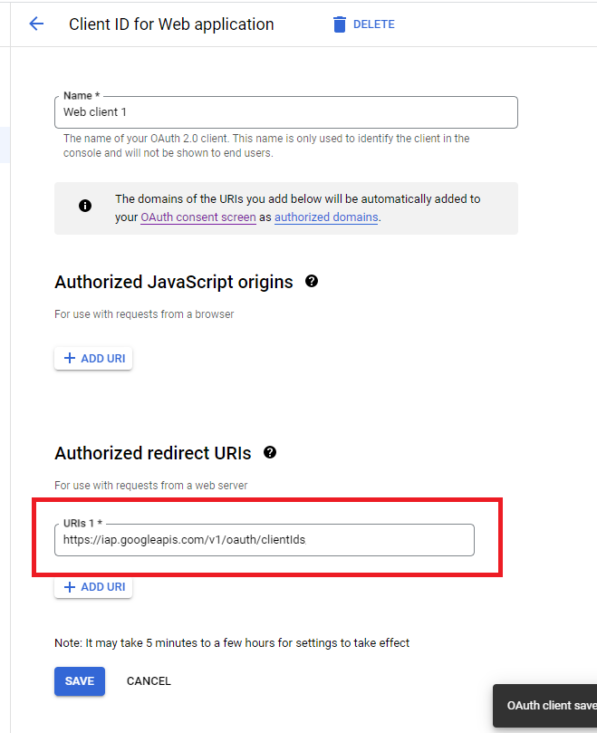

# Protect Web Application with IAP

## Advance preparation

1. create Google Cloud project

2. Configuring the OAuth consent screen  

    this step must be done manually on google cloud console,
    because it is not suppored by terraform. 

    * move https://console.cloud.google.com
    * select project you created.
    * open Navigation menu. 
    * select `APIs & Services`.
    * select `OAuth consent screen`.
    * check `External`.
    * click `CREATE` button.
    * input below data.
   
      |name    |value     |
      |:-------|:---------|
      |**App information**||
      |App Name|`IAP test`|
      |User support email| `your email address` |
      |**Developer contact information**||
      |Email address|`your email address`|
    
    * click `SAVE AND CONTINUE` button.
    * click `SAVE AND CONTINUE` button.
    * click `SAVE AND CONTINUE` button.
    * click `BACK TO DASHBOARD` button.

3. Configuration OAuth client

    this step must be done manually on google cloud console,
    because it is not suppored by terraform. 

    * move https://console.cloud.google.com
    * select project you created.
    * open Navigation menu. 
    * select `APIs & Services`.
    * select `Credentials`.
    * click `+CREATE CREDENTIALS` button.
    * select `OAuth client ID`.
    * input below data.
   
      |name    |value     |
      |:-------|:---------|
      |Application type|`Web application`|
      |Name| `Web client 1` |

    * click `CREATE` button.
    * click `DOWNLOAD JSON` button in `OAuth client created` dialog.
    * click `OK` button.

## App Engine

1. set project id and login

    ```
    # set target project id
    gcloud config set project {project you created}

    # log in owner user
    gcloud auth application-default login
    ```

2. create Google Cloud resources.

    if apply fails, try again.

    ```
    cd /path/to/repository/root/protect-webapp-with-iap
    terraform init
    # iap_client_id and iap_client_secret refer to the JSON downloaded in Advance preparation step 3. 
    terraform plan -var="accessible_email={accessible_email}" -var="{client_id}" -var="iap_client_secret={client_secret}" -var="{project_you_created}"
    terraform apply -var="accessible_email={accessible_email}" -var="{client_id}" -var="iap_client_secret={client_secret}" -var="{project_you_created}"
    ```

3. download sample app code.

    ```
    # download sample application code
    cd /tmp
    git clone https://github.com/GoogleCloudPlatform/python-docs-samples.git
    cd python-docs-samples/appengine/standard_python3/hello_world/
    ```


4. deploy sample application

    ```
    # deploy sample application
    gcloud app deploy
    ```

5. Configuration OAuth client

    this step must be done manually on google cloud console,
    because it is not suppored by terraform. 

    * move https://console.cloud.google.com
    * select project you created.
    * open Navigation menu. 
    * select `Security`.
    * select `Identity-Aware Proxy`.
    * disable `App Engine app` IAP switch.
    * enable `App Engine app` IAP switch.

      Turn IAP off and on once here, as the OAauth client redirect URL is not added. 

    * click `App Engine app` VERTICAL ELLIPSIS and click `Go to OAuth`
    
    * check adding `URIs 1` in `Authorized redirect URIs` section.
    
    * click SAVE button.

6. Access App Engine URL

    * verify authorization.


## Cloud Run

1. set project id and login

    ```
    # set target project id
    gcloud config set project {project you created}

    # log in owner user
    gcloud auth application-default login
    ```

2. create Google Cloud resources.

    if apply fails, try again.

    ```
    cd /path/to/repository/root/protect-webapp-with-iap
    terraform init
    # iap_client_id and iap_client_secret refer to the JSON downloaded in  Advance preparation step 3. 
    terraform plan -var="accessible_email={accessible_email}" -var="{client_id}" -var="iap_client_secret={client_secret}" -var="{project_you_created}"
    terraform apply -var="accessible_email={accessible_email}" -var="{client_id}" -var="iap_client_secret={client_secret}" -var="{project_you_created}"
    ```

3. create Docker image.

    ```
    cd cloud_run_image
    gcloud builds submit --config cloudbuild.yaml --substitutions=_LOCATION="asia-northeast1",_REPOSITORY="hello-cloudrun",_IMAGE="hello-cloudrun"
    ```
